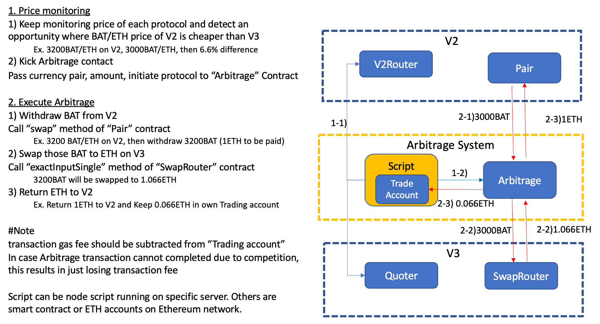

# Arbitrage between Uniswap Protocol Version

This project demonstrates Proof of Concept(PoC) of arbitrage between Uniswap V2 and V3.
At the moment, PoC covers following scope.
- Monitor and detect the arbitrage opportunities of BAT/ETH pair between V2 and V3
- Implement flash swap arbitrage function in smart contract for V2-to-V3 direction. 
- Implement flash swap arbitrage function in smart contract for V3-to-V2 direction with Flash() function of UniswapV3Pool.

In addition to above flashswap function, PoC work for permit is also done, this will enable user wallet to skip token approve procedure,
in case you use some asset of your own wallet for arbitrage. 
Please note that permit function is not widely implemented in ERC20 token yet. We tried Uniswap token, which is one of exceptions,  this time, but still there is some issue as written in source code.

## Architecture

